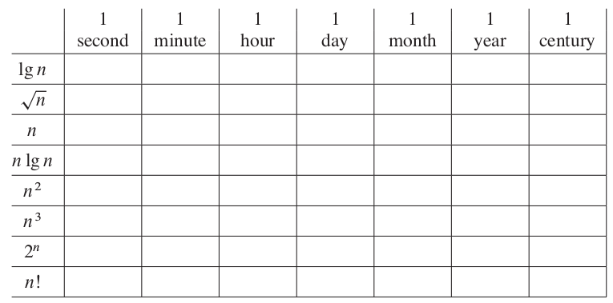

For each function f .n/ and time t in the following table, determine the largest
size n of a problem that can be solved in time t, assuming that the algorithm to
solve the problem takes f .n/ microseconds.

run alg_num.py

lg_n = 10^(1.00e+06), 10^(6.00e+07), 10^(3.60e+09), 10^(8.64e+10), 10^(2.59e+12), 10^(3.15e+13), 10^(3.15e+15)

sqrt_n = 1.00e+12, 3.60e+15, 1.30e+19, 7.46e+21, 6.71e+24, 9.92e+26, 9.92e+30

n = 1.00e+06, 6.00e+07, 3.60e+09, 8.64e+10, 2.59e+12, 3.15e+13, 3.15e+15

n_lg_n = 8.67e+06, 4.18e+08, 8.71e+09, 2.29e+11, 2.54e+12, 2.20e+14

n^2 = 1.00e+03, 7.75e+03, 6.00e+04, 2.94e+05, 1.61e+06, 5.61e+06, 5.61e+07

n^3 = 1.00e+02, 3.91e+02, 1.53e+03, 4.42e+03, 1.37e+04, 3.16e+04, 1.47e+05 

2^n = 1.99e+01, 2.58e+01, 3.17e+01, 3.63e+01, 4.12e+01, 4.48e+01, 5.15e+01

n! =  9, 11, 12, 13, 15, 16, 17

#Conclusion#

The most efficient algs in descending order:
1. lg(n) - log
2. sqrt(n) - exponential, where 0 < exp < 1
3. n*lg(n) - log-linear
4. n - linear
5. n^2, n^3  - exponential, exp >= 1
6. 2^n - exponential, where n >= 1
7. n! - factorial